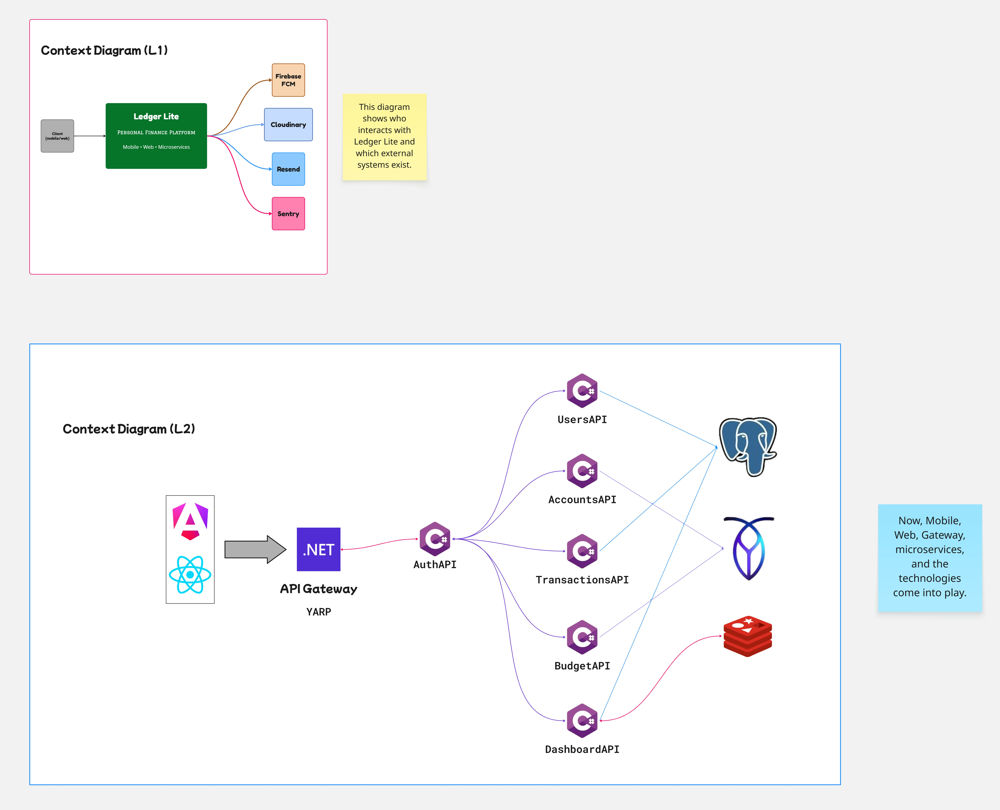
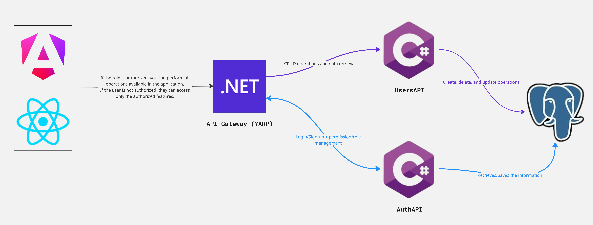
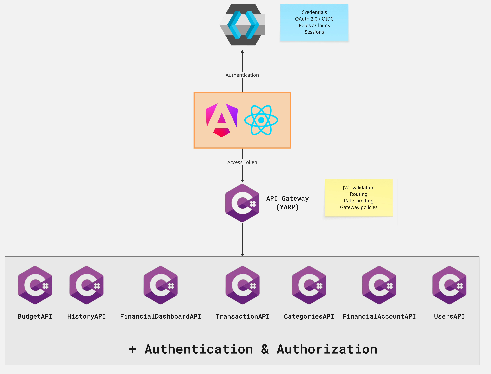
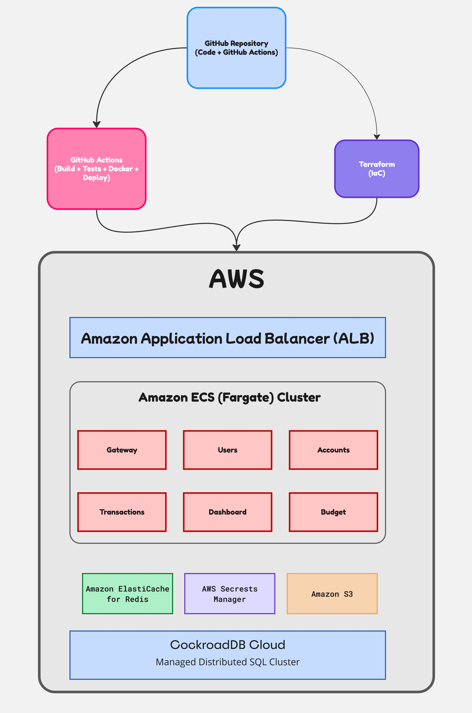

# 👨‍🔧 LedgerLiteUsersAPI.UsersAPI

**.NET 10 • C# 14 • Coherence Modelling • Vertical Slice Architecture • Clean Architecture • PostgreSQL • Redis • Docker • GitHub Actions CI/CD**

---

## 💎 Overview

`LedgerLiteUsersAPI` is the **User Management microservice** of the LedgerLite ecosystem, responsible for managing users, authentication-related user data, roles, profiles, and ownership within the platform for automotive mechanics and workshops.

The service is built with **Clean Architecture** and **Vertical Slice Architecture**, applying **Coherence Modelling** to keep business capabilities isolated, cohesive, and easy to evolve over time.

Designed with a **domain-first** approach, the project prioritizes maintainability, scalability and testability while remaining independent of infrastructure and external frameworks.

### 🎯 Goals

+ Model user-related business rules in a cohesive domain;
+ Expose a modular and versionable HTTP API;
+ Support CQRS-style use cases through Vertical Slices;
+ Be ready to evolve into independent bounded contexts or standalone microservices without major architectural changes.

---

## 📑 Table of Contents

+ [Coherence Modelling (Overview)](#-coherence-modelling-overview)
+ [Architecture Overview](#-architecture-overview)
+ [Project Structure](#-project-structure)
+ [Development Environment](#-development-environment)
+ [Running with Docker](#-running-with-docker-and-env)
+ [Migrations](#-migrations)
+ [Vertical Slice Structure](#-vertical-slice-structure)
+ [Context Map](#-context-map-simplified)
+ [API Documentation](#-api-documentation)
+ [Testing](#-testing)
+ [CI/CD Pipeline](#-cicd-pipeline)
+ [Conventions & Coding Standards](#-conventions--coding-standards)

---

# 🧠 Coherence Modelling (Overview)

**Coherence Modelling** is a software architecture and domain modelling approach created by **me**. It focuses on organizing systems around highly cohesive business capabilities, promoting clear boundaries, low coupling, scalability and long-term maintainability.

The approach is designed to work alongside architectures such as **Clean Architecture** and **Vertical Slice Architecture**, enabling modular systems that can evolve naturally into bounded contexts or independent microservices.

> [!IMPORTANT]
>
> **Coherence Modelling is a proprietary architectural approach created by Pedro Mequelim.** For documentation, implementation details, or adoption guidance, please contact the author directly.

---

## 🧱 Architecture Overview

+ The `LedgerLiteUsersAPI` project follows:

  + **Vertical Slice Architecture**;

    + Each feature owns its commands, handlers, validators, and mappings.

  + **Coherence Modelling**;

    + Entities, Value Objects, Aggregates, and business rules are implemented cleanly and independently.

  + **REST API with Controllers (no Minimal APIs)**;

    + Chosen for clearer separation, testability, and maintainability.

  + **PostgreSQL + EF Core**;

    + `snake_case` naming convention, clean database modeling, and migrations included.

  + **Dockerized Development Environment**.

    + Seamless startup with Docker Compose.

### Solution Structure

> [!IMPORTANT]
>
> Update this topic at the end of the project.

```
LedgerLiteUsersAPI/
├── src/
    ├──Tests/                    # Unit Tests (Test-Driven Development [TDD])
    │   ├── Users.Application.Tests/
    │   ├── Users.Domain.Tests/
    │   ├── Users.Persistence.Tests/
    │   └── Users.WebAPI.Tests/
    ├── Users.Application/       # Use cases and application orchestration
    │   ├── DTO/
    │   ├── Features/
    │   ├── Mappings/
    │   └── Users.Application
    ├── Users.Domain/            # Core domain (no dependencies)
    │   ├── Entities/
    │   ├── Exceptions/
    │   ├── Interfaces/
    │   ├── Validators/
    │   └── Users.Domain.csproj
    ├── Users.Persistence/       # Use cases and application orchestration
    │   ├── Configurations/
    │   ├── Database/
    │   ├── Interceptors/
    │   ├── Repositories/
    │   └── Users.Persistence.csproj
    ├── Users.WebAPI/       # Use cases and application orchestration
    │   ├── Common/
    │   ├── Controllers/
    │   ├── Properties/
    │   ├── appsettings.json
    │   ├── appsettings.Development.json
    │   ├── DependencyInjection.cs
    │   ├── Program.cs
    │   └── Users.WebAPI.csproj
    ├── .gitignore
    └── LedgerLiteUsersAPI.slnx
├── .dockerignore
├── .editorconfig
├── .env.example
├── .gitignore
├── CONTRIBUTING.md
├── docker-compose.yaml
├── Dockerfile
├── LICENSE.md
└── README.md
```

### Clean Architecture Layers

```markdown
┌─────────────────────────────────────────────┐
│                  WebAPI                    │  ← Entry point, thin host
│      (Program.cs, Exception Handler)        │
├─────────────────────────────────────────────┤
│              Infrastructure                 │  ← EF Core, Repository, Interceptors
│             (External World)                │
├─────────────────────────────────────────────┤
├─────────────────────────────────────────────┤
│                Persistence                  │  ← EF Core, Repository, Interceptors
│           (DbContext, Repository)           │
├─────────────────────────────────────────────┤
│                Application                  │  ← Vertical slices live here
│ (Features, Handlers, Validators, Endpoints) │
├─────────────────────────────────────────────┤
│                  Domain                     │  ← Entities, Result, Errors
│      (User, AuditableEntity, Error)         │
└─────────────────────────────────────────────┘
```

---

## 🔧 Environment Setup

+ This project uses a single `.env` file at the repository root.

---

## 🛠 Development Environment

### Requirements

+ .NET 10 SDK;
+ Docker & Docker Compose;
+ PostgreSQL (if running outside Docker);
+ GitHub account (for CI/CD).

### Build project

```shell
dotnet build --configuration Release
```

### Restore dependencies

```shell
dotnet restore
```

---

## 🐳 Running with Docker and `.env`

### To start API + PostgreSQL

```shell
docker compose up --build
```

### To stop containers

```shell
docker compose down
```

### API will run on

```shell
http://localhost:8080
```

### PostgreSQL runs on

> [!NOTE]
>
> Add your credentials to the `.env` file.

---

## 🗃 Migrations

### Update Entity Framework Core (EF Core)

```shell
dotnet tool update --global dotnet-ef
```

### To add migration

```shell
dotnet ef migrations add {MigrationName} --project .\Users.Persistence\ --startup-project .\Users.WebAPI\ --output-dir Persistence\Migrations
```

> [!NOTE]
>
> Change the `{MigrationName}` field to the name you want to give your migration!

### To apply migration

```shell
dotnet ef database update --project .\Users.Persistence\ --startup-project .\Users.WebAPI\
```

### To remove a migration

```shell
dotnet ef migrations remove --project .\Users.Persistence\ --startup-project .\Users.WebAPI\
```

---

## 🧩 Vertical Slice Structure

> [!IMPORTANT]
>
> This structure isolates business logic and promotes scalability.

+ Each slice contains:

```markdown
LedgerLiteUsersAPI.Users
├── Update/
    ├── Command.cs
    ├── Handler.cs
    ├── Validator.cs
    └── Response.cs
```

### Example

```markdown
Feature/User/CreateUser/
├── CreateUserCommand.cs
├── CreateUserHandler.cs
├── CreateUserValidator.cs
└── CreateUserResponse.cs
```

---

## 🗺 Context Map (simplified)



> [!NOTE]
>
> Each context communicates only through well-defined application boundaries.

### How are EmployeesAPI endpoints prepared to communicate with the OrderServiceAPI service?



---

## Authetication, Authorization & Security Flow



---

## Deployment Strategy



---

## 📘 API Documentation

> [!WARNING]
>
> Update link at the end of the project!

+ Scalar auto-generates documentation at `{link}`.

---

## 🧪 Testing

+ `LedgerLiteUsersAPI` uses:
  + xUnit;
  + FluentAssertions;
  + TDD methodology;
  + Tests isolated by Vertical Slice.

### Run all tests

```shell
dotnet test
```

---

## 🚀 CI/CD Pipeline

### CI/CD Environment Injection

+ During the CI/CD pipeline:

  + `.env` is generated dynamically;
  + Secrets are pulled from GitHub;
  + The Docker image is built using injected values;
  + No environment file is stored in the repository;
  + This ensures security and flexibility across environments.

### CI

+ Restore, build, tests, coverage;
+ Runs on every push.

### CD

+ Docker image built & pushed to GHCR;
+ Deployments triggered per branch:
  + `development` → DEV environment;
  + `homol` → Homologation environment;
  + `master` → Production

### Approvals Required

+ **Production** and **homologation** deploys require manual approval via **GitHub Environments**.

---

## ✨ Conventions & Coding Standards

+ C# 14 features enabled;
+ Nullable reference types active;
+ EF Core uses snake_case naming;
+ Controllers are thin;
+ Application logic lives in slices;
+ Entities contain domain rules;
+ Services avoided unless absolutely necessary;
+ Async everywhere (async/await default);
+ Clean exception handling;
+ Clear separation of concerns.

---

## 📄 License

+ MIT License;
+ Free to use, modify and distribute.

---

## 👨‍💻 Author

+ Pedro Henrique Mequelim da Silva;
+ Mobile & Backend Engineer;
+ Brazil, 🇧🇷
